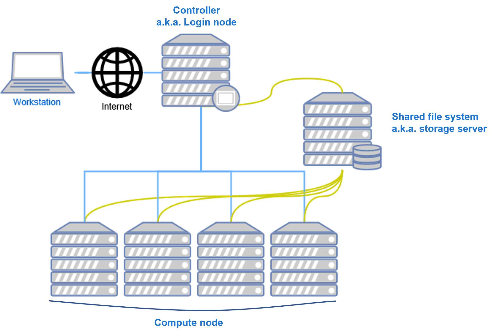

# SLURM Intro

**SLURM; Simple Linux Utility for Resource Management.**

Linux에서 리소스(CPU, RAM, GPU, storage, ...) 등을 관리하기 위해 사용하는 오픈소스 툴입니다.
사용하는 방식에 따라서 다양한 자원을 관리할 수 있으나 우리 연구실에선 GPU만 관리하기로 했습니다.

## SLURM 기본 개념 이해

SLURM을 사용하기 위해 알아야하는 기본 개념들에 대해 알아보겠습니다.

### 물리적 구성

(*Image from [this](https://implement.pt/2018/09/slurm-in-ubuntu-clusters-pt2/) blog*)

slurm은 기본적으로 3가지 종류의 서버(a.k.a. node)로 구성돼있습니다.

- Login node
  - slurm controller(slurmctld)가 설치돼있는 중앙 서버
  - 실제로 우리가 SSH로 접속하게될 곳이라 login node라고 부름
  - 외부로 IP가 공개된게 이 node 뿐이므로 다른 서버에 접속하고 싶을땐 login node를 통해서만 접근 가능
- Compute node
  - 실제로 GPU가 설치된 서버
- Storage server
  - SLURM을 사용할 땐 모든 node들이 같은 환경을 유지할 수 있도록 일부 디렉토리를 공유하도록 설정함.
  - `/home` 디렉토리를 공유하도록 설정해뒀으므로 login node의 `~` 경로에서 작업하면 compute node에서도 해당 파일을 사용할 수 있음.

### 논리적 구성

- job
  - user에게 resource를 할당해주는 단위 / slurm이 스케줄링을 하는 단위
  - 하나의 job은 1개 이상의 (job) step으로 구성됨.
  - 연구실 사용 시나리오에서 여러 step을 이용할 필요가 없을 것 이라 판단해 1step job에 대해서만 설명합니다. 필요하다면 추후 추가하겠습니다.
- partition
  - node들을 묶는 logical set
  - partition에 job을 등록함 i.e. `partition == queue`
  - partition별로 최대 작업시간, 허용 GPU 개수 등 다양한 설정을 할 수 있음

## 연구실 SLURM 운영 정책

SLURM의 job scheduling 방식은 설정하기 나름이고 사용하는 기관마다 저마다의 정책을 설정해 사용하고 있습니다.
아래에는 우리 연구실에서 사용할 slurm 운영 정책에 대해 간단히 설명해 두었습니다.
해당 내용은 향후 변경될 수 있습니다.

1. L40 이상의 GPU만을 관리 대상으로 합니다.   
  이보다 이전 GPU는 기존과 같이 개인이 관리하며 사용합니다.
2. 두가지 종류의 queue(팀별 & 공용)를 사용합니다.
    - 팀별 queue는 gpu fairness를 고려해 최대 사용 GPU를 제한합니다.
    - 공용 queue는 GPU 개수에 제한이 없습니다. 따라서 팀별 queue를 모두 사용한 경우, 공용 queue에 작업을 등록함으로써 다른 팀에서 사용하지 않는 GPU를 사용할 수 있습니다.
    - 우선순위는 `팀별 queue > 공용 queue` 이므로 GPU가 모자란 경우 공용 queue의 작업을 강제로 kill하고 팀별 queue에 GPU를 할당합니다.
    따라서, 공용 queue를 사용하는 경우 주기적으로 checkpoint를 생성해야합니다.

---
TODO
- 컨테이너 사용
- Open OnDemand
- server monitoring tool(script)
- ddp